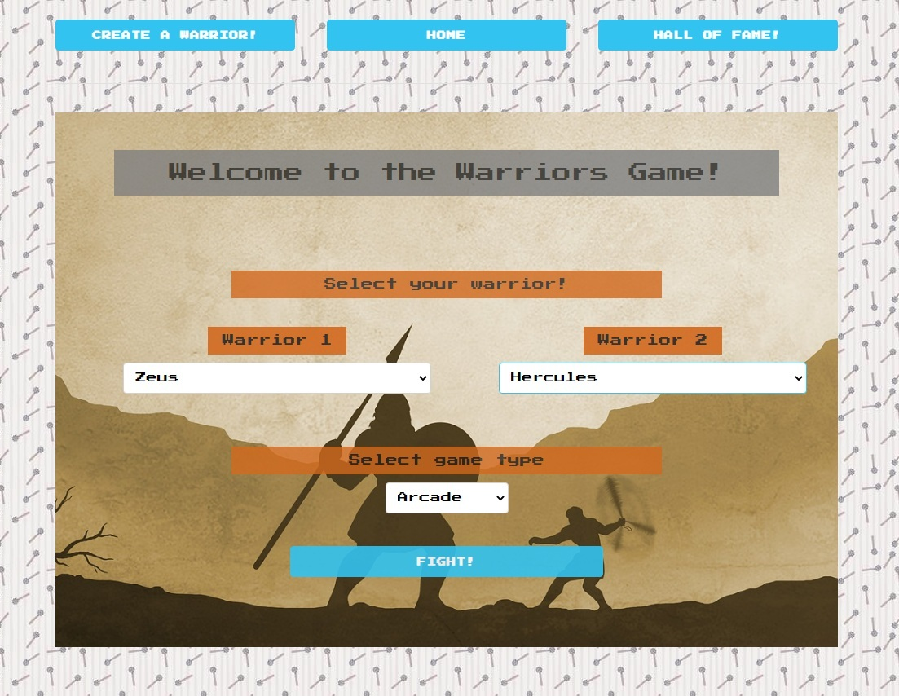
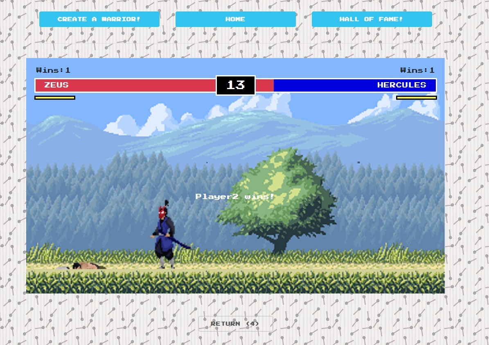

<div align="center">  
  <h1>Warriors!</h1>
  
  # :video_game: <a href="https://warriors.networkmanager.pl/warriors">View Demo</a>
  
</div>  
<br/>
<!-- Table of Contents -->  

# :notebook_with_decorative_cover: Table of Contents

- [About the Project](#star2-about-the-project)
    * [Tech Stack](#space_invader-tech-stack)
    * [Features](#dart-features)
- [Getting Started](#toolbox-getting-started)
    * [Prerequisites](#heavy_exclamation_mark-prerequisites)
    * [Run Locally](#running-run-locally)
- [Usage](#eyes-usage)
- [Acknowledgements](#gem-acknowledgements)

<br/>

# :star2: About the Project

* a little game written using JavaScript, TypeScript, Handlebars and Canvas
* 2 types of game:
  - text only
  - arcade type, where 2 players can fight with each other
* you can create your own warrior and add him to the rooster
* you can check your win stats in the hall of fame

<br/>

# :space_invader: Tech Stack

<details>  
  <summary>Client</summary>  
  <ul>  
    <li>JavaScript</li>
    <li>HTML Canvas</li>
    <li>Handlebars</li>  
    <li>Skeleton</li>

  </ul>  
</details>  
<details>  
  <summary>Server</summary>  
  <ul>  
    <li>Express</li>  
    <li>Typescript</li>
  </ul>  
</details>  

<details>  
<summary>Database</summary>  
  <ul>  
    <li>MySQL</li>  
  </ul>  
</details>  

## Technology stack
<p align="left">
 &nbsp; &nbsp;
 &nbsp;&nbsp;
 &nbsp;&nbsp;
 &nbsp;&nbsp;
 &nbsp; &nbsp;
 &nbsp; &nbsp;
 &nbsp; &nbsp;
 &nbsp; &nbsp;
&nbsp;&nbsp;
&nbsp;&nbsp;
</p>

<!-- Features -->  

<br/>

# :dart: Features

- create your own warrior and decide which skills to improve :heavy_check_mark: <br>
  
- select your warrior, and a game type :heavy_check_mark: <br>
  
- fight against your opponent in 2d game :heavy_check_mark: <br>
  
  <hr>
  
- watch the fight in text mode :heavy_check_mark:
  
  <hr>
  
- check your results in the hall-of-fame which shows top-10 warriors :heavy_check_mark: <br>
  

<br/>

# :toolbox: Getting Started

### :key: Environment Variables

In order to run this app you need to create config.ts and place it in config folder. File should contain following
fields with your correct data, for instance:

```json  
const config = {  
    dbHost: 'localhost',  
    dbUser: 'user',  
    dbDatabase: 'yourDatabaseName',
    dbPassword: '',
}
```

<!-- Prerequisites -->  

### :heavy_exclamation_mark: Prerequisites

You have to create your database by using this SQL:

```
CREATE TABLE IF NOT EXISTS `warriors` (
`id` varchar(36) COLLATE utf8mb4_unicode_ci NOT NULL DEFAULT uuid(),
`name` varchar(20) COLLATE utf8mb4_unicode_ci NOT NULL,
`healPoints` int(2) DEFAULT NULL,
`strength` int(2) DEFAULT NULL,
`defence` int(2) DEFAULT NULL,
`agility` int(2) DEFAULT NULL,
`victories` int(2) NOT NULL DEFAULT 0,
PRIMARY KEY (`id`)
) ENGINE=InnoDB DEFAULT CHARSET=utf8mb4 COLLATE=utf8mb4_unicode_ci;
```

```bash  
 npm install --global npm  
```  

<!-- Run Locally -->  

<br/>

# :running: Run Locally

Clone the project

```bash  
 git clone https://github.com/RavenPl/warriors
```  

Go to the project directory

```bash  
 cd Warriors 
```  

Install dependencies

```bash  
 npm install  
```  

Start the server

```bash  
 npm run start:dev
```  

<!-- Usage -->  

<br/>

# :eyes: Usage

1. Arcade game controls:

  * player 1: A,D - left and right; W - jump; SPACE - hit;
  * player 2: left, right, up arrow keys for movement, down arrow key for hitting;

2. Text-only type:

  * click fight button to generate fight log;

<!-- Acknowledgments -->

<br/>

# :deciduous_tree: Lessons Learned

<p>This project was made to put together HTML, JavaScript, Typescript, Handlebars and DataBase into one, working application.</p>
<p>It was my first introductin to HTML Canvas. I mainly code along tutorial but I was able to add my own elements. </p>

<br/>

# :gem: Acknowledgements

**Used readme template:**

- [Awesome Readme Template](https://github.com/Louis3797/awesome-readme-template)

**Used icons:**

* <a href="https://www.flaticon.com/free-icons/armor" title="armor icons">Armor icons created by Nikita Golubev -
  Flaticon</a>
* <a href="https://www.flaticon.com/free-icons/sword" title="sword icons">Sword icons created by pongsakornRed -
  Flaticon</a>
* <a href="https://www.flaticon.com/free-icons/sword" title="sword icons">Sword icons created by Freepik - Flaticon</a>
* <a href="https://www.flaticon.com/free-icons/pixel" title="pixel icons">Pixel icons created by Futuer - Flaticon</a>
* <a href="https://www.flaticon.com/free-icons/sport" title="sport icons">Sport icons created by Freepik - Flaticon</a>
* <a href="https://www.flaticon.com/free-icons/death" title="death icons">Death icons created by Freepik - Flaticon</a>
* <a href="https://www.flaticon.com/free-icons/award" title="award icons">Award icons created by Freepik - Flaticon</a>
* <a href="https://www.flaticon.com/free-icons/shield" title="shield icons">Shield icons created by Parzival’ 1997 -
  Flaticon</a>
* <a href="https://www.flaticon.com/free-icons/gaming" title="gaming icons">Gaming icons created by Freepik -
  Flaticon</a>
* <a href="https://www.flaticon.com/free-icons/blood" title="blood icons">Blood icons created by srip - Flaticon</a>
* <a href="https://www.flaticon.com/free-icons/dead" title="dead icons">Dead icons created by srip - Flaticon</a>
* <a href="https://www.flaticon.com/free-icons/win" title="win icons">Win icons created by Wichai.wi - Flaticon</a>
* <a href="https://www.flaticon.com/free-icons/attack" title="attack icons">Attack icons created by Freepik -
  Flaticon</a>
  
**Arcade mode was inspired by youtube tutorial:**
  
* <a href="https://www.youtube.com/watch?v=vyqbNFMDRGQ">JavaScript Fighting Game Tutorial - Chris Courses<a/>
